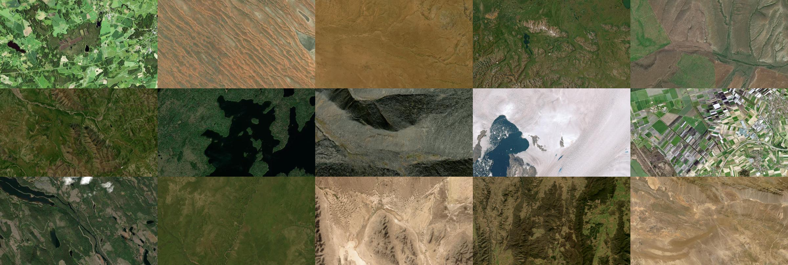

# worldview

Create an image of a random location in the world (from an XYZ server). The sequel to [earthview-desktop](https://github.com/ryan-mooore/earthview-desktop).

# Getting started

This project uses [renv](https://rstudio.github.io/renv/articles/renv.html) for dependency management. To install dependencies, make sure you have `renv` installed (run `install.packages("renv")` within an R shell). Then:

1. Inside the root of the project, enter an R shell and run `renv::activate()`.
2. Quit (`q()`) and re-enter the R shell and run `renv::restore()`.
3. Quit the shell. Dependencies have been installed.

Simply run `Rscript worldview.R` to execute.

## Script options

| Option           | Description                                                                                                                                                                                                                                                                                                                                             |
| ---------------- | ------------------------------------------------------------------------------------------------------------------------------------------------------------------------------------------------------------------------------------------------------------------------------------------------------------------------------------------------------- |
| `TILESERVER`     | XYZ Server to download tiles from. Use `${x}` etc. for substitution.                                                                                                                                                                                                                                                                                    |
| `COUNTRY`        | Optionally select a country which the script will pick a random location within.If not a valid country or is an empty string, will pick from the world instead.                                                                                                                                                                                         |
| `ZOOM`           | Zoom level of XYZ tiles to choose from (1-16). If passed a vector of length 2, will choose a random tile zoom level between the two numbers. Risk of unavailable data at higher zoom levels if using a worldwide composite basemap.                                                                                                                     |
| `SIZE`           | Size in pixels of resulting image.                                                                                                                                                                                                                                                                                                                      |
| `DOWNSAMPLE`     | If set to 1 or above, will gather tiles at that number of zoom levels higher than chosen and then downsample back to original resolution. Helpful for normalizing spatial resolution if the basemap varies. Setting this downloads exponentially more tiles and can result in unavailable data at higher zoom levels. Recommend 0 for most tileservers. |
| `WRITE_IMAGE`    | (TRUE/FALSE) Whether to save the resulting image.                                                                                                                                                                                                                                                                                                       |
| `WRITE_LOCATION` | (TRUE/FALSE) Whether to save a geocoded location name of the image location.                                                                                                                                                                                                                                                                            |
| `OUTPUT_DIR`     | Directory to save the output (if applicable).                                                                                                                                                                                                                                                                                                           |
| `FILENAME`       | Filename of the output (if applicable).                                                                                                                                                                                                                                                                                                                 |
| `PLOT`           | (TRUE/FALSE) Whether to open a plot of the output, titled with a geocoded location name.                                                                                                                                                                                                                                                                |

# Examples

The **examples** directory contains scripts that can interface with/show the capability of worldview. Feel free to PR with your own scripts.

- ### set-wallpaper-mac.sh
  A script that uses worldview to select a random image of the world, then sets it as the macOS wallpaper. Make sure to set the output size, directory, and filename correctly for this to work. Additionally, a cron job can be set up to run this script (e.g. to change the wallpaper every hour: `0 * * * * bash -l worldview/examples/set-wallpaper-mac.sh`).
